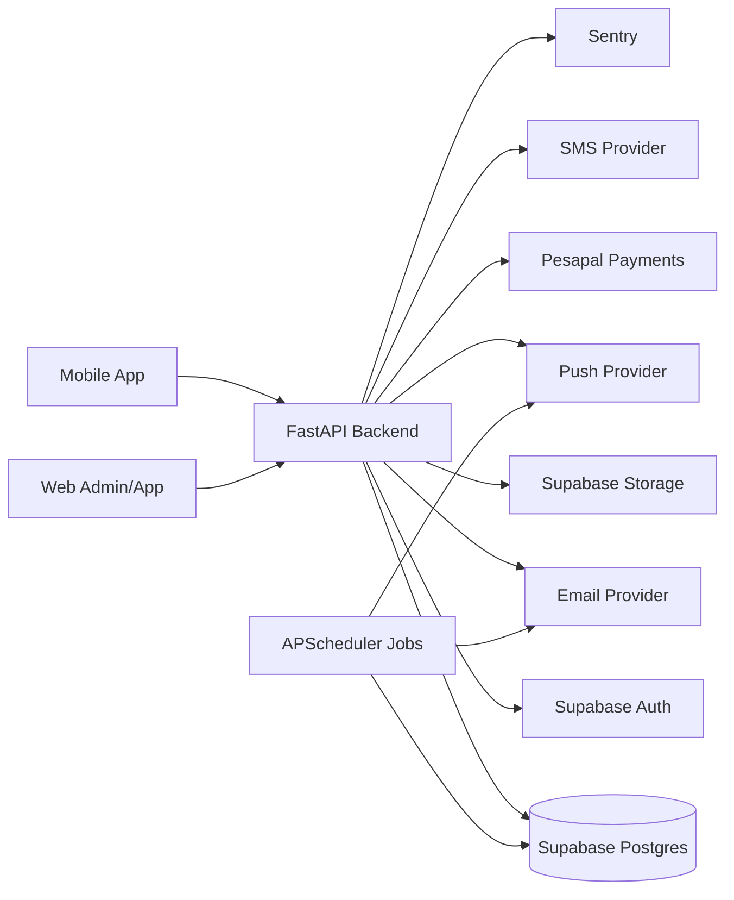
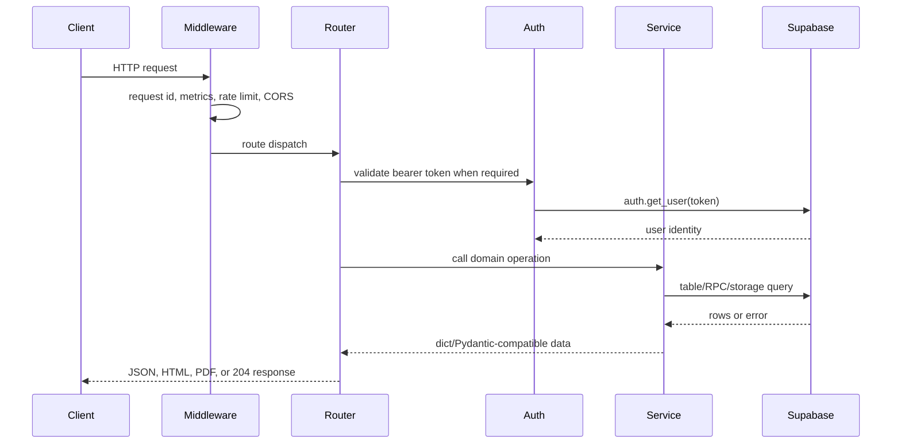
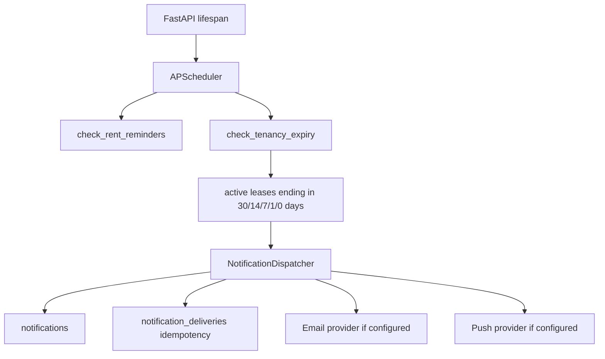

# Backend Architecture

## System Context

The backend is the platform API layer. It validates requests, resolves authenticated users, enforces route-level ownership checks, calls Supabase/Postgres through service classes, and returns Pydantic response models. Supabase RLS remains the database-level enforcement layer.

## Request Lifecycle

## Runtime Components

| Component | Location | Responsibility |
| --- | --- | --- |
| App bootstrap | `backend/main.py` | FastAPI app, lifespan, routers, middleware, exception handling, metrics, endpoint listing. |
| Dependencies | `backend/dependencies` | Supabase clients, current user resolution, optional user, admin guard. |
| Routers | `backend/routers` | HTTP route declarations, request validation, response models, route-level authorization checks. |
| Services | `backend/services` | Data access, retries, multi-table workflows, receipts, scheduler dispatch, observability helpers. |
| Models | `backend/models` | Pydantic request/response schemas and API-visible field contracts. |
| Migrations | `backend/migrations`, `supabase/migrations` | Postgres schema, indexes, RLS, triggers, and notification tables. |
| Tests | `backend/tests` | FastAPI TestClient coverage, mocked Supabase behavior, rate limiting, scheduler behavior. |

## Middleware And Cross-Cutting Behavior

| Concern | Implementation | Behavior |
| --- | --- | --- |
| Request IDs | `RequestIDMiddleware` in `main.py` | Adds `X-Request-ID`, records request context for Sentry, logs request completion. |
| Metrics | `main.py` in-memory counters | Tracks request count, error count, latency buckets, and top paths exposed at `/metrics`. |
| Rate limiting | `RateLimitMiddleware` in `main.py` | Global per-IP limits, stricter auth and payment buckets, HTTP 429 with rate-limit headers. |
| Error envelope | exception handlers in `main.py` | Standardizes HTTP, validation, and unhandled errors with request IDs. |
| CORS | `CORSMiddleware` | Uses `cors_origins` from settings. |
| Retries | `with_retry` in `services/base.py` | Retries transient Supabase/service operations with exponential backoff. |
| Sentry | `services/observability.py` | Initializes Sentry and records request/user context when configured. |

## Background Jobs

Jobs start only when `testing` is false. Tenancy expiry reminders are idempotent through `notification_deliveries(event_key, channel)`.

## External Integrations

| Integration | Usage | Configuration |
| --- | --- | --- |
| Supabase Auth | Token validation, sign-up, sign-in, profile bootstrap | `SUPABASE_URL`, `SUPABASE_ANON_KEY`, `SUPABASE_SERVICE_ROLE_KEY` |
| Supabase Postgres | All core persistence | Supabase project DB plus migrations |
| Supabase Storage | Payment proof and property image uploads | Storage buckets `payment-proofs`, `property-images` |
| Pesapal | Payment initiation and webhook updates | `PESAPAL_CONSUMER_KEY`, `PESAPAL_CONSUMER_SECRET`, `PESAPAL_ENVIRONMENT` |
| SMS provider | SMS dispatch endpoint | `SMS_PROVIDER_URL`, `SMS_PROVIDER_API_KEY` |
| Email provider | Tenancy expiry email reminders | `EMAIL_PROVIDER_URL`, `EMAIL_PROVIDER_API_KEY`, `EMAIL_FROM_ADDRESS` |
| Push provider | Tenancy expiry push reminders | `PUSH_PROVIDER_URL`, `PUSH_PROVIDER_API_KEY` |
| Sentry | Error monitoring | `SENTRY_DSN` or `SENTRY_ENDPOINT` |

## Deployment Notes

- Run migrations before deploying API code that depends on new columns, indexes, tables, or RLS policies.
- Keep `backend/migrations` and `supabase/migrations` aligned when a migration needs to be applied through Supabase tooling.
- OpenAPI is generated from code. Do not hand-edit `docs/backend/openapi.json`.
- Production should replace in-memory webhook idempotency and rate-limit stores with shared storage if multiple API instances are deployed.
