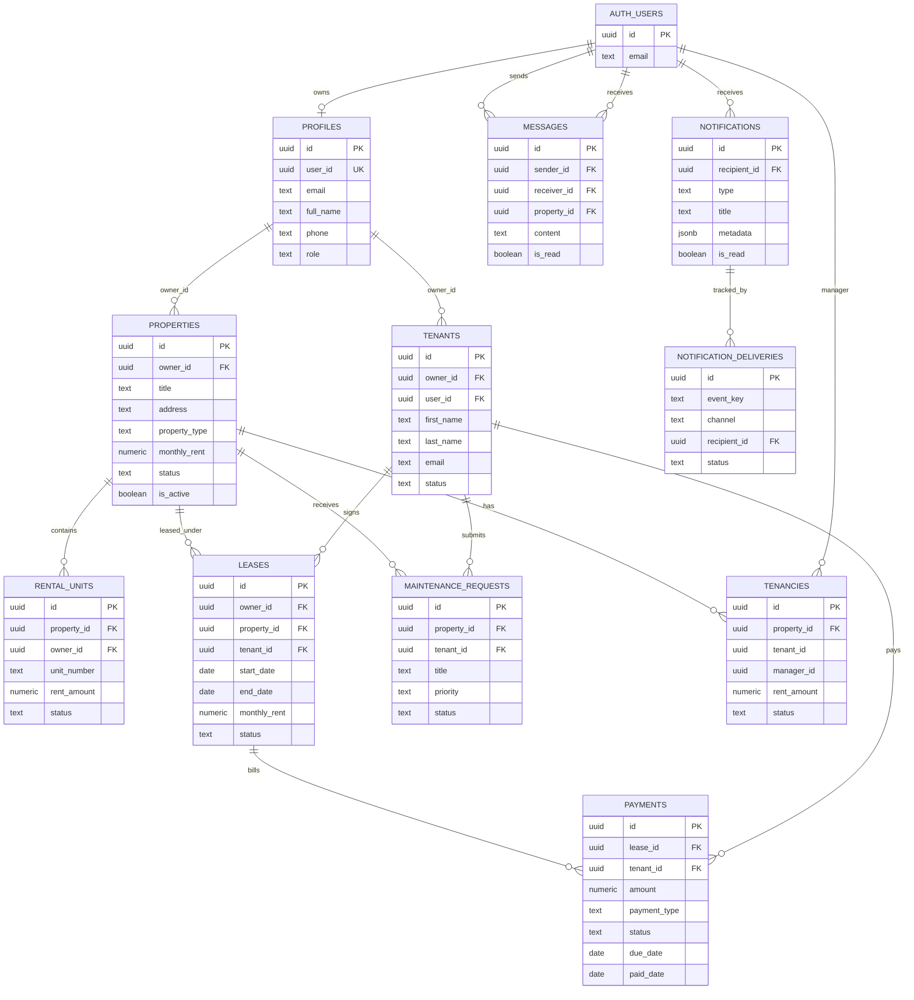

# Database Schema And ERD

The backend persists core marketplace, tenancy, payment, messaging, notification, and upload metadata in Supabase Postgres. Migrations live in `backend/migrations` and Supabase deployment copies live in `supabase/migrations`.

## ERD

## Core Tables

| Table | Purpose | Primary Writers |
| --- | --- | --- |
| `profiles` | App profile for Supabase users, including role and contact data. | Auth signup trigger, auth profile routes. |
| `properties` | Marketplace property records and listing metadata. | Properties router/service. |
| `rental_units` | Unit-level records for multi-unit properties. | Rental units router. |
| `tenants` | Tenant records managed by owners/managers, optionally linked to an auth user. | Tenants router/service. |
| `leases` | Contractual link between owner, property, and tenant. | Leases router/service; scheduler reads active leases. |
| `payments` | Rent, deposits, late fees, and other payment records. | Payments router/service; Pesapal webhook updates. |
| `maintenance_requests` | Tenant/manager maintenance workflow. | Maintenance router/service. |
| `messages` | In-app messaging between users. | Messages router. |
| `notifications` | In-app notification inbox. | Scheduler notification dispatcher. |
| `notification_deliveries` | Idempotency and delivery audit for in-app, email, and push channels. | Scheduler notification dispatcher. |
| `tenancies` | Additional tenancy-period table used by newer tenancy workflows. | Migration-defined; currently background work primarily reads `leases`. |

## Important Constraints And Indexes

| Area | Constraint/Index |
| --- | --- |
| Property type | Restricted to supported marketplace categories in current migrations and models: `Residential`, `Office Space`. |
| Payment status | `pending`, `completed`, `failed`, `refunded`. |
| Lease status | `draft`, `active`, `expired`, `terminated`, `renewed`. |
| Notification idempotency | `UNIQUE(event_key, channel)` on `notification_deliveries`. |
| Filtering indexes | Composite indexes support multi-parameter filters for properties, tenants, leases, payments, and profiles. |
| Ownership indexes | Owner, tenant, property, lease, status, and date indexes support common API filters and authorization checks. |

## Module To Table Mapping

| Module | Tables Read | Tables Written |
| --- | --- | --- |
| Auth | `profiles`, Supabase `auth.users` | `profiles`, Supabase Auth |
| Properties | `properties` | `properties` |
| Rental Units | `rental_units`, `properties` | `rental_units` |
| Tenants | `tenants` | `tenants` |
| Managers | `profiles` | None |
| Leases | `leases`, `tenants` | `leases` |
| Payments | `payments`, `leases`, `tenants`, `properties`, `profiles` | `payments` |
| Receipts | `payments`, `leases`, `tenants`, `properties`, `profiles` | None |
| Maintenance | `maintenance_requests`, `properties` | `maintenance_requests` |
| Messages | `messages`, `profiles` | `messages` |
| Uploads | Supabase Storage | Supabase Storage |
| Webhooks | `payments` | `payments` |
| Scheduler | `leases`, `tenants`, `properties`, `notifications`, `notification_deliveries` | `notifications`, `notification_deliveries` |

## Migration Notes

- Apply migrations in timestamp/order sequence.
- Prefer additive migrations for production changes.
- When an API feature depends on indexes or new constraints, include both `backend/migrations` and Supabase migration copies when applicable.
- Keep Pydantic model constraints aligned with database constraints so invalid requests fail before reaching Postgres.
