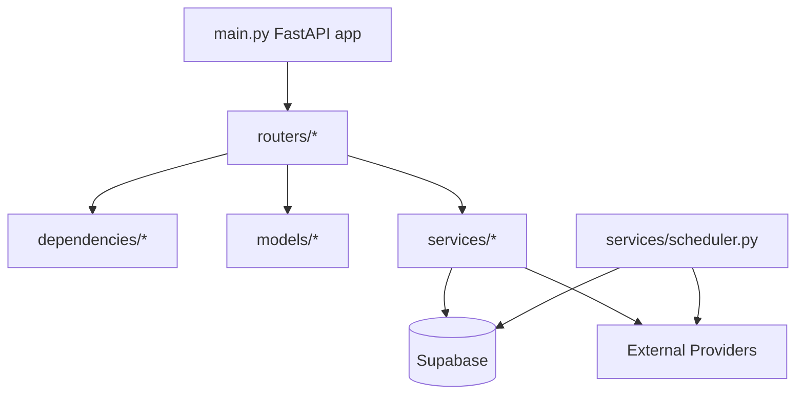
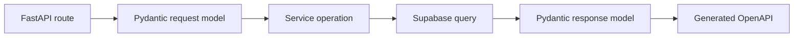

# Services And Modules

## Module Map

## Routers

| Router | Prefix | Primary Models | Service Layer | Notes |
| --- | --- | --- | --- | --- |
| `auth.py` | `/auth` | `ProfileResponse`, auth request/response models | `AuthService`, Supabase Auth | Signup, sign-in, token refresh, profile, roles. |
| `properties.py` | `/properties` | `PropertyCreate`, `PropertyUpdate`, `PropertyResponse` | `PropertyService` | Private owner routes and public listing routes; supports filtering. |
| `tenants.py` | `/tenants` | `TenantCreate`, `TenantUpdate`, `TenantResponse` | `TenantService` | Owner-scoped tenant CRUD and email resolution. |
| `leases.py` | `/leases` | `LeaseCreate`, `LeaseUpdate`, `LeaseResponse` | `LeaseService` | Owner and tenant-self listing paths. |
| `agreements.py` | `/agreements` | Agreement document/consent models | `AgreementService` | Agreement PDF/image upload, consent status, explicit consent audit trail. |
| `managers.py` | `/managers` | `ProfileResponse` | `ManagerService` | Lists profiles with `house_manager` role. |
| `payments.py` | `/payments` | `PaymentCreate`, `PaymentUpdate`, `PaymentResponse` | `PaymentService`, receipt renderer | Payments, Pesapal initiation, PDF/printable receipts. |
| `rental_units.py` | `/rental-units` | `RentalUnitCreate`, `RentalUnitUpdate`, `RentalUnitResponse` | Direct Supabase queries | Multi-unit property records. |
| `maintenance_requests.py` | `/maintenance` | `MaintenanceRequestCreate`, `MaintenanceRequestUpdate`, `MaintenanceRequestResponse` | `MaintenanceRequestService` | Property maintenance workflow. |
| `messages.py` | `/messages` | `MessageCreate`, `MessageUpdate`, `MessageResponse` | Direct Supabase queries | Conversations, unread count, message send/read state. |
| `uploads.py` | `/uploads` | `UploadResponse` | Supabase Storage | Payment proof and property image uploads. |
| `terms.py` | `/terms` | `TermsVersion`, `TermsConsentRequest/Response`, `TermsStatusResponse` | Direct Supabase queries | Terms & conditions version management, user consent recording and status check. |
| `tracking.py` | `/tracking` | `PageViewCreate`, `PageViewResponse`, `PageViewStats` | Direct Supabase queries | Page-view and click tracking with session metadata. |
| `phone_auth.py` | `/auth/phone` | `PhoneSignInRequest`, `PhoneVerifyRequest`, `PhoneSignInResponse` | Supabase Auth | Phone-based OTP sign-in and verification flow. |
| `forex.py` | `/forex` | — | httpx + `services/forex.py` | Currency conversion and rate listing (UGX base, 6h cache). |
| `agreement_generator.py` | `/agreements/generate` | `AgreementGenerateRequest` | ReportLab `services/agreement_generator.py` | Server-side PDF tenancy agreement generation with signatures and terms. |
| `webhooks.py` | root | Webhook/SMS models | Supabase service client, HTTP providers | Pesapal webhook, SMS dispatch. |

## Service Classes

| Service | File | Responsibilities |
| --- | --- | --- |
| `BaseService` | `services/base.py` | Shared Supabase table access and retry wrapper. |
| `AuthService` | `services/auth.py` | Auth-related helper operations. |
| `PropertyService` | `services/crud.py` | Property CRUD, public listings, multi-filter queries. |
| `TenantService` | `services/crud.py` | Tenant CRUD, owner-scoped filters. |
| `ManagerService` | `services/crud.py` | House manager profile listing and search. |
| `LeaseService` | `services/crud.py` | Lease CRUD and tenant/owner filtering. |
| `AgreementService` | `services/agreements.py` | Agreement upload authorization, SHA-256 hashing, consent state composition, immutable audit events. |
| `PaymentService` | `services/crud.py` | Payment CRUD, owner/tenant payment filtering, receipt data assembly. |
| `MaintenanceRequestService` | `services/crud.py` | Maintenance request CRUD by property. |
| Receipt renderer | `services/receipts.py` | `ReceiptData`, printable HTML, ReportLab PDF generation. |
| Agreement generator | `services/agreement_generator.py` | `generate_agreement_pdf()` — ReportLab PDF generation for tenancy agreements with tenant/manager signatures and standard terms. |
| Forex service | `services/forex.py` | `convert()`, `get_all_rates()` — currency exchange via open.er-api.com with 6-hour in-memory cache and fallback rates. |
| Tracking service | `services/tracking.py` | Page-view aggregation, popular property counts. |
| Scheduler | `services/scheduler.py` | Rent reminder checks, tenancy expiry reminders, notification dispatch. |
| Observability | `services/observability.py` | Sentry initialization and request/user context. |

## API Contract Flow

FastAPI uses route signatures and Pydantic models to generate `/openapi.json`. The checked-in contract at [openapi.json](openapi.json) is generated from the same source.

## Service Boundary Guidance

- Routers should validate request shape, resolve auth dependencies, and translate domain failures into HTTP errors.
- Services should own Supabase query composition, reusable filters, retries, and multi-table assembly.
- Models should describe external API contracts; do not expose internal-only fields unless they are intentionally part of the API.
- Background jobs should be idempotent and safe to rerun.
- External provider calls should be isolated and have clear skipped/error behavior when credentials are not configured.

## Generated Documentation Workflow

1. Change route/model/service code.
2. Add or update tests.
3. Run `uv run python scripts/generate_openapi.py` from `backend`.
4. Review `docs/backend/openapi.json` diff for unintended contract changes.
5. Update the relevant Markdown docs when behavior, authorization, or schema expectations change.
